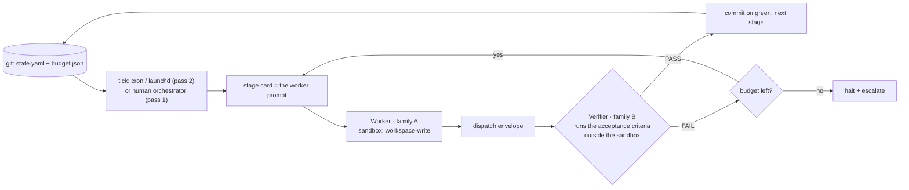

# Autometta

**Token-maxing is the gateway drug to AI psychosis. Autometta is a lightweight YOLO pattern library for headless agent orchestration on a single machine without constant human oversight. Worker agents code against requirement cards, verified by cross-family agents: Codex verifies Claude, and vice versa.**

  

## At a glance

- **What it is.** A set of contracts, markdown templates and thin bash scaffolding for running Claude Code and Codex CLI workers unattended on one laptop. Not a framework, not a runtime, not a hosted service.
- **Who it is for.** A solo developer with both CLIs installed who wants implementer plus verifier, or a few parallel workers on independent stages, sometimes interactively and sometimes overnight, without taking a framework dependency.
- **How it works.** A stage card is the worker's prompt. The worker codes inside a sandbox and returns an envelope. A verifier from the other model family runs the acceptance criteria outside that sandbox. Green lands as a commit; red re-briefs or halts. A cron tick drives the loop; a budget file is the only safety.
- **The bets.** Git is the state store. The sandbox is the role boundary. Worker and verifier are different model families. Cron plus tick beats a daemon. A bounded spend file beats retries.
- **Where it stands.** v1.0.0. Both layers are shipped and have been self-hosted through 109 stages on this repo and run daily across a seven-repo fleet. Single operator, one machine, macOS first with Linux via cron.

Jump to: [why](#why-this-exists) · [status](#status) · [which layer do I want](#decision-tree---which-layer-do-i-want) · [first dispatch in five minutes](#your-first-dispatch-five-minutes) · [billing routes](#billing-routes-three-tiers) · [feature status](#feature-status) · [reading order](#reading-order)

## Two families, one tree

This repo is designed for Claude Code and Codex CLI to work in the same tree without prejudice. Session state lives in the repo (`memory/`, `state/`, `stage-cards/`), not in any one harness's private directory. Every agent picks up the same context.

Not a framework. Not a runtime. Not a hosted service. A set of contracts, templates, and a thin shell scaffolding for running Claude Code + Codex workers unattended, with cross-family verification, on a solo developer's laptop.


`autometta dashboard --open` over a seven-repo fleet. Every stage the fleet has run, newest first and grouped by repo, with what each one spent; click a row or a bar to read the stage card that drove it. `autometta dashboard --repo <path>` gives the same page scoped to one repo, and `autometta tui <path>` is the terminal equivalent for a run in flight.



In pass 1 the human orchestrator runs the acceptance command before firing the verifier. In pass 2 the verifier runs it, and two adjacent stages with disjoint path claims may run as a pipeline pair while landing stays ordered.

Git is the state store, the sandbox is the role boundary, the worker and verifier are different model families, and the budget file is the only safety.

## Why this exists

Managing several agent threads across several projects is draining. Patterns like Steve Yegge's Gas Town show how multiple autonomous agents can run for long periods and produce reasonable results, provided enough effort goes into design, and verification artefacts.

The open source or commercial orchestrators are either token-heavy and API-biased, or cede control to higher-level interface surfaces. Some vendors are fussy about running their CLI inside another harness at all.

Autometta is a small implementation of agent orchestration. Cron is the heartbeat that survives laptop lid close with power, as long as the machine is configured appropriately. The contract dispatches worker and verifier roles as needed and runs against whichever auth the operator already has. Cross-family verification (Sonnet checking Codex, or the reverse) catches a class of failure that same-family self-verification silently misses.

Anthropic's Managed Agents (June 2026) has since shipped the hosted equivalent of the tick heartbeat and the credential injection. We keep autometta's version for cross-family verification, git-as-state with no hosted dependency, and family-agnostic dispatch on one machine. The full note is in [docs/prior-art.md](./docs/prior-art.md).

## Status

v1.0.0, tagged 2026-09-10. Pass 1 (the dispatch contract) and pass 2 (the autonomous loop) are both shipped, including the unattended macOS launchd path (verified 2026-05-29; `docs/lessons.md` gotcha 9).

The loop has built this repo with itself: 109 self-host stages have landed through the tick, cards 0 to 134, each one worker-authored, cross-family verified and committed with the `Autometta-*` role trailers. It runs daily across a seven-repo fleet. The first live one-shot product run turned a single creative brief into a five-stage simulation in about 4.5 hours; see the [Logistic Mandelbrot case study](./docs/case-study-logistic-mandelbrot.md).

1.0 means the contract, the loop and the operator surfaces are stable and in daily use. It does not mean teams or production: this is still one human, one machine, one OAuth session per family. The one formal cross-lane benchmark (BENCH-005, a multi-stage Swift refactor) escalated at the budget in both lanes without going green; see [examples/benchmarks/bench-005/](./examples/benchmarks/bench-005/) for the lane summaries and the cross-family asymmetry. A green benchmark on a non-trivial external backlog is still open.

## Supported platforms

macOS and Linux only. The scaffolding is bash plus standard POSIX tools and assumes either `cron` or (on macOS) `launchd` as the heartbeat. Windows is not supported - there is no native bash, no `cron`/`launchd`, no native `tmux`, and the `codex` CLI itself has no native Windows binary as of mid-2026. WSL2 may work as an effective Linux host but is untested and undocumented; treat it as unsupported.

| Platform | Pass 1 (dispatch contract) | Pass 2 (autonomous loop) | Notes                                                                                                   |
| -------- | -------------------------- | ------------------------ | ------------------------------------------------------------------------------------------------------- |
| macOS    | supported                  | supported                | First-class. Homebrew-local install. Heartbeat via `launchd` LaunchAgent (per-repo) or `cron` fallback. |
| Linux    | supported                  | supported                | Heartbeat via `cron`. Homebrew-local install is macOS-first; manual install or Linuxbrew elsewhere.     |
| Windows  | not supported              | not supported            | No native bash, `cron`, `launchd`, `tmux`, or native `codex` binary. WSL2 is untested.                  |

## What this is for

You're a solo developer. You have Claude Code and Codex CLI on one machine. You want to run multi-agent work - implementer + verifier, or N parallel workers on independent stages - sometimes interactively, sometimes overnight. You don't want to take a framework dependency to do it.

Autometta packages the contracts that make this work without surprise.

## What this is not for

- Teams. The patterns assume one human, one machine, one OAuth session per agent family.
- Production agent systems. No SLA or retry semantics beyond what the FSM provides.
- LLM-call orchestration inside a single process. Use LangGraph, CrewAI, or the Claude Agent SDK directly. Autometta is for the case where the worker is a CLI subprocess and the state lives on the filesystem.

## Two layers

| Layer                   | What it is                                                                                                                                                                                                                                                                      | Driver                        | Status                     |
| ----------------------- | ----------------------------------------------------------------------------------------------------------------------------------------------------------------------------------------------------------------------------------------------------------------------------- | ----------------------------- | -------------------------- |
| **Dispatch contract**   | The contract between an orchestrator and a worker for one unit of work. Stage card, worker prompt, acceptance command, sandbox boundary, dispatch envelope, verifier report.                                                                                                   | Human (orchestrator session)  | Pass 1 - shipped           |
| **Autonomous loop**     | A cron-driven tick that reads `state.yaml`, dispatches one worker and/or verifier, writes the next state, and exits. Declared two-stage pipeline pairs may overlap work while landing remains ordered. Budget file is the only safety. phat-controller, a scheduled queue minder, supervises it. | `cron` + `tick.sh`            | Pass 2 - shipped           |
| **Agent observability** | Per-agent liveness registry (`state/active-agents/`), heartbeat watchdog (`scripts/heartbeat.sh`), tmux tickers, polling primitive (`scripts/watch-agent.sh`), the `autometta tui` terminal view and the cost dashboard. Catches silent agent deaths in both manual and loop dispatches. | `scripts/heartbeat.sh` + tmux | Shipped (on top of pass 2) |

The loop layer is built on top of the dispatch layer. You can use dispatch without the loop. You cannot use the loop without dispatch. The agent observability layer plugs into both: any dispatcher registers via `scripts/register-agent.sh`, and the heartbeat + ticker surface that registry without further coupling.

## Decision tree - which layer do I want?

- **One stage, in front of me, I want to step through it** -> use the dispatch contract directly. Open an orchestrator session (Claude Code), fill in `templates/stage-card.md`, dispatch a Codex worker with `templates/worker-prompt.md`, verify yourself, commit.
- **Many stages, well-defined, I want to run them overnight** -> use the autonomous loop. Follow the [operator runbook](./docs/runbook.md), then inspect `autometta status`, `state/state.yaml`, and the controller log in the morning.
- **One stage, exploratory, I'm not sure what "done" looks like** -> don't use Autometta. Use a normal Claude Code session.

## Adopted patterns (and what we ignored)

After surveying the mid-2026 landscape:

**Adopted:**

- Git-backed ledger as the state store. From [Gas Town](https://github.com/gastownhall/gastown) (Beads).
- Per-agent persistent identity with ephemeral sessions. From `agent-whoami`.
- Stall-detection as a first-class state. From Gas Town's "mountain convoy" semantics.
- Architect / coder / verifier role split. From Aider's architect mode; cross-family verifier from pass-29.
- Sandbox-as-role-boundary. From the Codex `workspace-write` accident.
- MCP as the only integration boundary for tools.

**Ignored:**

- LangGraph, CrewAI, AutoGen - wrong abstraction level (in-process LLM, not CLI worker).
- OpenHands - competitor to Claude Code, not a wrapper.
- Vibe Kanban / Conductor / Claude Squad / Crystal - human-in-loop GUI shells, wrong audience.
- Gas Town the runtime - too heavy for 2-3 workers; we mine the patterns, not the code.

See `docs/philosophy.md` for the long-form version.

## Graph engineering

Karpathy's "Delete Everything, Keep Graph" lecture names the pattern this repo runs: the durable asset of an agentic loop is not the transcripts but the graph of what was learned. Autometta implements all five of the playbook's planes: the reflective loop (tick + acceptance + git reset), parallel execution (pipeline pairs in worktrees), grounded evaluation (cross-family verifier outside the sandbox), commit-DAG provenance (`Autometta-*` trailers on every landed change), and, since pass 5, a typed knowledge layer. `memory/facts.jsonl` is a committed ledger of subject-predicate-object facts with a schema and a lint, backfilled from the trailers, appended by the tick on every landing and read by the verifier as a bounded slice before it judges. The original assessment and the vendor comparison are in [docs/graph-engineering.md](./docs/graph-engineering.md); the ledger contract is in [docs/fact-ledger.md](./docs/fact-ledger.md).

## History -> future

Autometta did not start from a blank page. It packages two earlier projects: the fractals-from-the-90s dispatch contract (the stage card, the acceptance command, the headless gotchas) and the agentic-rag-kimble pass 28-29 autonomous loop (the cron tick, the budget file, the cross-family verification protocol). Steve Yegge's Gas Town supplied the inspiration and three patterns taken verbatim (git-backed ledger, persistent agent identity, stall detection as a first-class state); Aider's architect/coder split supplied the role taxonomy. The bets were made early and on purpose: cron plus tick over a daemon, git as the state store, the sandbox as the role boundary, worker and verifier in different model families, a budget file as the only safety.

The market then moved, mostly towards the same choices.

- The mid-2026 survey in [docs/prior-art.md](./docs/prior-art.md) found every serious tool converging on the same shape: git as the state backbone, state machine over messages, stage-card-as-brief, sandbox-enforced role split, cron + tick + budget. Its own conclusion was "roll your own runtime, but stop calling it novel".
- Anthropic's Managed Agents (June 2026) shipped the hosted equivalent of the tick heartbeat and the credential injection. We keep our version for cross-family verification, git-as-state with no hosted dependency, and family-agnostic dispatch; the postscript in prior-art.md records why.
- Karpathy's "Delete Everything, Keep Graph" lecture named the pattern this repo already ran, and also named where it lagged: `memory/` was prose, not a typed knowledge layer. Pass 5 closed that gap with the fact ledger.
- Both vendors' agent SDKs run on subscription auth (Codex confirmed 2026-08-31; the Claude Agent SDK 2026-09-01). The raw Claude API SDK does not: it returns 429 on an OAuth token, so the route guard keeps that pairing on the CLI.

| Date    | Autometta                                                                                                     | The market                                                                                       |
| ------- | ------------------------------------------------------------------------------------------------------------- | ------------------------------------------------------------------------------------------------ |
| 2026-05 | Landscape survey banked; v0.1.0 tagged (dispatch contract, tick loop, unattended launchd path)                | Gas Town, Aider and the consensus patterns already in circulation                                |
| 2026-06 | Loop kept; the reasons recorded in prior-art.md                                                               | Anthropic Managed Agents: hosted cron and credential vaults                                      |
| 2026-08 | v0.2.0 operator instrumentation; graph assessment; pass 5 designed, queued and landed                         | Karpathy's lecture and its playbook name the pattern; vendor SDKs confirmed on subscription auth |
| 2026-09 | v1.0.0: fact ledger, SDK transport matrix, gate integrity, fault handling; 109 self-host stages, seven-repo fleet | Codex CLI 0.149 narrows the free local route to the gpt-oss family                               |

Three experiments closed against adoption on the way. A resident SDK controller (card 23) lost to cron plus tick; a worker SDK route (card 98) was tried and parked; the herdr multiplexer (card 87) was retired on 2026-08-31 because the SDK transport covered the need it was probing. Both postmortems are under `docs/experiments/`. Cloud-hosted orchestration (card 27) is designed and not queued. The bets from the first paragraph are unchanged; the passes since have been about making the loop remember what it learned and refuse to lie about what it checked.

## Layout

```
autometta/
├── README.md                 # this file
├── MANUAL.md                 # the operator's manual: every command, file and state
├── HANDOFF.md                # dated session handoff, one status line at the top
├── LICENSE
├── CLAUDE.md / AGENTS.md     # shared agent brief (AGENTS.md is a symlink)
├── op-refs.sh                # placeholder op:// reference table (real refs live outside the repo)
├── bin/
│   └── autometta             # CLI wrapper over the shell scripts
├── docs/
│   ├── philosophy.md         # design philosophy, scope, non-goals
│   ├── dispatch-contract.md  # pass 1 - the contract
│   ├── dispatch-envelope.md  # the worker's completion signal
│   ├── verification.md       # pass 1 - the gate model
│   ├── lessons.md            # hard-won failure modes (headless gotchas 1-20)
│   ├── tick-loop.md          # pass 2 - the autonomous loop design and operating record
│   ├── setup.md              # pass 2 - operator setup guide, auth routes in section 7
│   ├── runbook.md            # cold-start and daily operator path
│   ├── phat-controller.md    # the scheduled queue minder
│   ├── budget.md             # caps, drains and the quota window
│   ├── cost-log.md           # per-role spend records and prompt caching
│   ├── fact-ledger.md        # pass 5 - the typed fact ledger
│   ├── sdk-verifier.md       # SDK transports, per family, and the route guard
│   ├── verifier-panel.md     # three-seat verifier quorum
│   ├── verifier-bake-off.md  # free-tier verifier measurements
│   ├── retro-grade.md        # re-grading landed stages via the Batch API
│   ├── deployment.md         # central install, manifests, submodule escape hatch
│   ├── observability.md      # status, tickers, tmux viewer, heartbeat
│   ├── dashboard.md          # the cost dashboard
│   ├── remote-monitoring.md  # hosted health checks
│   ├── machine-dependencies.md
│   ├── prior-art.md          # what was adopted and what was ignored
│   ├── graph-engineering.md  # where autometta stands against the graph playbook
│   ├── PUBLISH-WORKFLOW.md   # private dev / public publish branch model and gate
│   ├── design/ experiments/ incidents/ runs/   # designs, postmortems, dated records
│   └── images/
├── templates/
│   ├── stage-card.md         # one card per dispatch
│   ├── worker-prompt.md      # the prompt the worker reads
│   ├── verifier-prompt.md    # the prompt the verifier reads
│   ├── orchestrator-checklist.md
│   └── phat-controller-*     # the queue minder's prompt, mandate and seed
├── scripts/                  # pass 2 runtime and operator surfaces: tick, dispatch, pipeline pairs,
│                             #   controller, observability, TUI, dashboard, fact ledger, build and
│                             #   vendor checks, setup, refresh, launchd, retention, publish guards,
│                             #   and the *-smoke.sh contract tests the verifier gate runs
├── dashboard/                # static dashboard page and vendored Chart.js
├── packaging/                # local Homebrew formula template
├── schemas/                  # state.yaml, budget.json, envelope and verifier artefact schemas
├── state/                    # per-repo runtime state (gitignored content)
├── stage-cards/              # self-host stage cards and PLAN.md - the worked examples
├── memory/                   # cross-session agent memory and facts.jsonl (in-repo)
├── skills/                   # skills hosted by this repo
│   ├── agent-orchestrator/   # canonical home (mcp-hub copy is a symlink back)
│   ├── autometta-setup/      # adopt the dispatch contract and the loop in another repo
│   ├── autometta-run-design/ # design a run: cards, pairings, gates, spend
│   ├── autometta-requeue/    # re-queue a stage safely after a FAIL or a dead agent
│   └── phat-controller/      # the queue minder's brief
├── tests/                    # contract-gate and drain smokes, SDK experiment fixtures
└── examples/
    ├── fractals-stage-cards/ # older cards from another project, kept for cross-project shape
    ├── benchmarks/           # end-to-end benchmark runs (e.g. bench-005)
    └── bake-off/             # verifier bake-off fixtures and scored artefacts
```

## Reading order

1. `docs/philosophy.md` - what we believe and why.
2. `docs/dispatch-contract.md` - the load-bearing document.
3. `docs/lessons.md` - the headless gotchas that will bite you on day one.
4. `templates/stage-card.md` and `templates/worker-prompt.md` - copy these, fill them in. For filled-in examples read this repo's own recent cards: `stage-cards/131-a-card-carries-its-own-oracle.md` shows the contract-test block and its digest, and `stage-cards/113-a-card-pairs-unless-it-says-serial.md` shows path claims and pairing metadata.
5. `docs/verification.md` - how to gate the worker's output.
6. `docs/tick-loop.md` and `docs/setup.md` - when you want to put the dispatch contract under cron. `docs/setup.md` section 7 covers subscription, API-key and free verifier routes.
7. `docs/deployment.md` and `docs/observability.md` - when you want to adopt it across repos and watch the loop.
8. `docs/runbook.md` - the ordered cold-start and daily operator path. `MANUAL.md` is the reference behind it.

## Your first dispatch (five minutes)

The fastest way to see what this is.

1. Clone Autometta somewhere you can reach from your target project.
2. In the target project, open an orchestrator session in Claude Code (or Codex CLI; the orchestrator role is family-agnostic).
3. Copy three files into the target repo:
  ```sh
   mkdir -p stage-cards
   cp <Autometta>/templates/stage-card.md stage-cards/01-my-first-stage.md
   cp <Autometta>/templates/worker-prompt.md /tmp/worker-prompt.md
   cp <Autometta>/templates/orchestrator-checklist.md /tmp/checklist.md
  ```
4. Fill in `stage-cards/01-my-first-stage.md` - one objective, one deliverable, one acceptance command. Walk through the orchestrator checklist in `/tmp/checklist.md` as you go.
5. Dispatch a worker from the orchestrator session. Read it the stage card path. The worker writes code; you run the acceptance command yourself; if it passes, fire a verifier (a different model family) to audit the change. Commit on green.

That is pass 1. No `scripts/`, no `tick.sh`, no cron. Read `docs/dispatch-contract.md` for the full seven-step protocol; read `docs/lessons.md` for the headless gotchas before your second dispatch.

When the same loop is worth automating, install the local CLI and initialise the repo:

```sh
scripts/install-homebrew-local.sh
autometta init /path/to/target-repo
git -C /path/to/target-repo add .gitignore state/state.yaml state/budget.json
git -C /path/to/target-repo commit -m "Initialise Autometta"
autometta status
autometta attach /path/to/target-repo
```

Then follow `docs/setup.md` to put `autometta tick` under cron. Read `docs/deployment.md` first if the repo needs pinned provenance rather than the default central install.

## Updating an existing repo

Update the installed CLI from this checkout, then check the subscriber:

```sh
cd /path/to/autometta
git pull --ff-only
scripts/install-homebrew-local.sh   # brew update alone is not enough
autometta --version                 # should match `git rev-parse --short HEAD`
autometta check-build               # installed-build versus checkout check
```

Sessions started before the upgrade stay pinned to the old Cellar version until re-sourced or restarted; the ticker, fleet viewer and TUI warn on build drift. Full upgrade notes, including when `autometta init` is needed again, are in [docs/deployment.md](./docs/deployment.md).

## Billing routes: three tiers

Every dispatched worker or verifier runs on one of three tiers: **subscription** (OAuth session: Claude Pro / ChatGPT plan), **api** (a metered key, injected per dispatch), or **free** (codex-family only: `auth.codex.mode: local` runs Ollama weights on the same machine at zero marginal cost). Every launch goes through `op-fetch` (`env -i` plus an allowlist plus only the named refs), so subscription mode strips any stray `OPENAI_API_KEY` / `ANTHROPIC_API_KEY` from the parent shell rather than silently flipping you to API billing. Missing tooling, an unset `OP_REF_`*, or an unresolved placeholder fails closed before a token is spent.

The mode lives per repo in `.autometta.local.yaml` (gitignored); the real `op://` references live once per machine in `~/.config/autometta/op-refs.local.sh` (gitignored, mode 0600); the keys themselves live only in 1Password. Dispatch-time env overrides beat the manifest. Verify before dispatching:

```sh
autometta auth status         # mode + ref provenance per family
autometta auth check codex    # PASS / FAIL / subscription, no token spend
autometta auth check claude
```

The free local tier is measurement-backed: `docs/verifier-bake-off.md` retro-grades eight free candidates against ten benchmark stages and recommends `gpt-oss:120b` for mechanical-acceptance stages only. No free candidate exceeded 77% FAIL recall, so free-tier verification lowers cost on mechanical stages; it does not replace a frontier verifier on judgement calls. As of codex-cli 0.149.1 only the gpt-oss family still dispatches on `--oss` (lessons gotcha 19), so six of the eight measured rows cannot be re-run today.

Full surface, including the op-refs file layout, the sibling `CODEX_HOME` required for codex api mode, the cloud free tier, the SDK transport per family, and the what-does-not-work list, is in [docs/setup.md](./docs/setup.md) section 7. The wrapper design follows the `auth-route-security` skill.

## Known limitations

- **No green external benchmark yet.** BENCH-005 drove the contract against a multi-stage Swift refactor; neither lane met the pass condition (see `examples/benchmarks/bench-005/`). The self-host record is long; the external one is a single red run.
- **Single operator.** No SLA, no retry semantics beyond the budget FSM, one OAuth session per agent family.
- **The raw Claude API SDK does not accept subscription auth.** An OAuth token handed to the Messages client gets a 429, so the SDK verifier route on a Claude subscription is guarded back to the CLI unless the Agent SDK surface is named explicitly. See `docs/sdk-verifier.md`.
- **The free local route is one model family wide.** codex-cli 0.149.1 refuses any Ollama model without thinking support, which leaves gpt-oss.

## Feature status

| Feature                                                    | Status       | Notes                                                                                                                                                   |
| ---------------------------------------------------------- | ------------ | ------------------------------------------------------------------------------------------------------------------------------------------------------- |
| Dispatch contract (pass 1)                                 | shipped      | Self-hosted through 109 stages on this repo.                                                                                                            |
| Autonomous loop (pass 2)                                   | shipped      | Unattended macOS launchd path verified 2026-05-29 (gotcha 9 fix). Linux via cron.                                                                       |
| Pipeline pairs                                             | shipped      | Adjacent stages with disjoint path claims overlap; landing stays ordered. A card pairs unless it says serial.                                            |
| phat-controller (queue minder)                             | shipped      | Scheduled pass that re-briefs, re-queues, drains and escalates; keeps a journal and takes messages.                                                     |
| Contract-test gate                                         | shipped      | A card names its oracle and a frozen digest; `add-stage.sh` refuses a card without one; the verifier runs the gate against the tree it is shown.        |
| Fact ledger (pass 5)                                       | shipped      | `memory/facts.jsonl`, schema and lint, backfilled from trailers, appended at landing, read by the verifier.                                              |
| Worker dispatch envelope                                   | shipped      | Sole worker completion signal; `partial` goes to the verifier with the deferred criteria as a checklist.                                                |
| Agent observability                                        | shipped      | Registry, heartbeat with token-outlier kill, tickers, watch primitive.                                                                                  |
| Terminal UI                                                | shipped      | `autometta tui`: live run, history and controller-message pages, token burn while it burns.                                                             |
| Cost dashboard                                             | shipped      | `autometta dashboard`: fleet or per-repo, liveness pulse, one time zone, card click-through.                                                            |
| Auth routing (subscription / API / local)                  | shipped      | `op-fetch`, fail-closed, per-family toggle.                                                                                                             |
| SDK verifier route + prompt caching                        | shipped      | Both families. Default where its preconditions hold; subscription OAuth on the raw Claude API SDK is guarded to the CLI; `agent-sdk` is opt-in.         |
| Free verifier tier, local (codex `auth.codex.mode: local`) | shipped      | Zero-cost Ollama route, measurement-backed default (`gpt-oss:120b`). See "Billing routes" above.                                                        |
| Free verifier tier, cloud bake-off                         | experimental | Measured in `docs/verifier-bake-off.md`; run manually via `scripts/verifier-bake-off.sh`, not a stage-card-selectable mode yet.                         |
| Verifier panel                                             | shipped      | Three-seat quorum via `autometta panel`.                                                                                                                |
| Retro-grade                                                | shipped      | `autometta retro-grade` re-runs the rubric over landed stages via the Batch API.                                                                        |
| Budget drains and quota window                             | shipped      | `autometta drain`, reserve windows that read the clock, a daytime run leaves the operator a session.                                                    |
| Network preflight                                          | shipped      | A dead network does not spend a dispatch; a worker retrying a dead API is stalled, not waited on.                                                       |
| Remote monitoring                                          | shipped      | Hosted PR-only health checks under `scripts/monitoring/`.                                                                                               |
| Worker SDK route                                           | parked       | Card 98 tried it; the postmortem is in `docs/experiments/`. `spawn-worker.sh` has no transport knob.                                                    |
| Resident SDK controller                                    | rejected     | Card 23 concluded for cron plus tick; postmortem in `docs/experiments/`.                                                                                |
| Cloud-hosted orchestration                                 | parked       | Card 27, designed and not queued.                                                                                                                       |

## Version history

| Version | Date       | Highlights                                                                                                                                                                                                         |
| ------- | ---------- | ------------------------------------------------------------------------------------------------------------------------------------------------------------------------------------------------------------------ |
| v0.1.0  | 2026-05-29 | First tagged release: dispatch contract, tick loop and unattended launchd path.                                                                                                                                    |
| v0.2.0  | 2026-08-27 | Operator instrumentation: TUI, pipeline pairs, `run_id`, stale-build warning, dashboard seam speedup, and the bake-off completed across eight candidates.                                                          |
| v1.0.0  | 2026-09-10 | Fact ledger; SDK verifier route on both families with the subscription route guard; the card carries its own oracle and the gate stops lying about its inputs; network preflight and dead-API stalls; drains replace rather than stack; workers no longer inherit the operator's MCP servers; 109 self-host stages landed. |

## Licence

MIT. See [LICENSE](./LICENSE).
