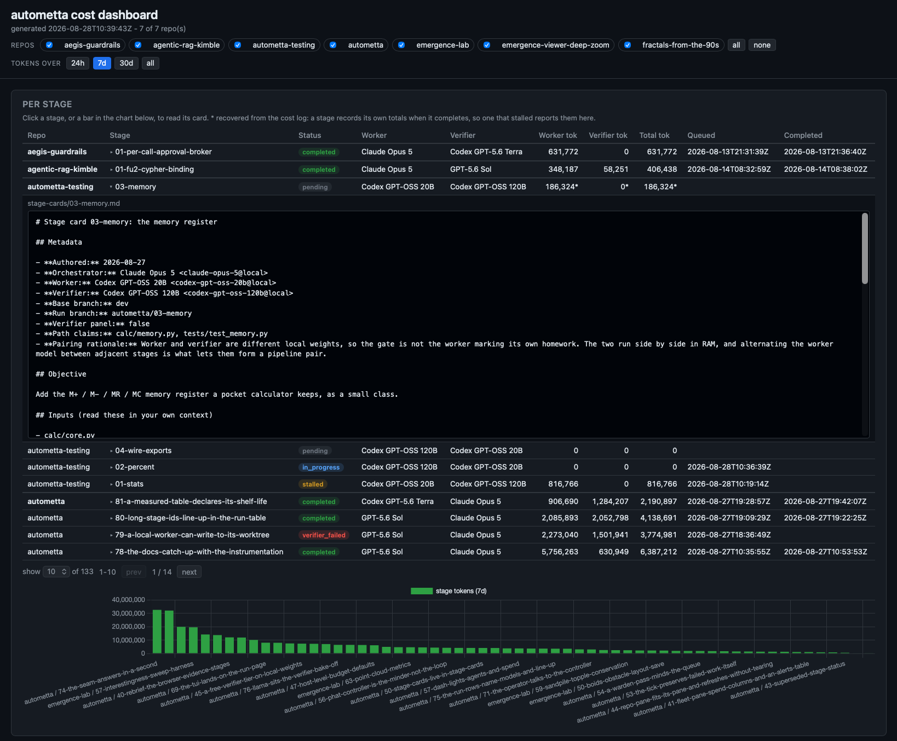
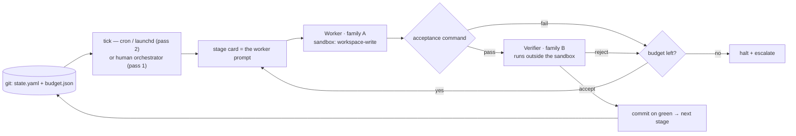

# Autometta

**Token-maxing is the gateway drug to AI psychosis. Autometta is a lightweight YOLO pattern library for headless agent orchestration on a single machine without constant human oversight. Worker agents code against requirement cards, verified by cross-family agents: Codex verifies Claude, and vice versa.**

 




`autometta dashboard --open` over a seven-repo fleet. Every stage the fleet has
run, newest first and grouped by repo, with what each one spent; click a row or
a bar to read the stage card that drove it. `autometta dashboard --repo <path>`
gives the same page scoped to one repo, and `autometta tui <path>` is the
terminal equivalent for a run in flight.




Git is the state store, the sandbox is the role boundary, the worker and verifier are different model families, and the budget file is the only safety.

## Why this exists

Managing several agent threads across several projects is draining. Patterns like Steve Yegge's Gas Town show how multiple autonomous agents can run for long periods and produce good results, provided enough effort goes into specs, design, and verification artefacts.

The open source or commercial orchestrators are either token-heavy and API-biased, or cede control to higher-level interface surfaces. Some vendors are fussy about running their CLI inside another harness at all.

Autometta is a small implementation of agent orchestration. Cron is the heartbeat that survives laptop lid close with power, as long as the machine is configured appropriately. The contract dispatches worker and verifier roles as needed and runs against whichever auth the operator already has. Cross-family verification (Sonnet checking Codex, or the reverse) catches a class of failure that same-family self-verification silently misses.

Anthropic's Managed Agents (June 2026) has since shipped the hosted equivalent of the tick heartbeat and the credential injection. We keep autometta's version for cross-family verification, git-as-state with no hosted dependency, and family-agnostic dispatch on one machine. The full note is in [docs/prior-art.md](./docs/prior-art.md).


## Two families, one tree

This repo is designed for Claude Code and Codex CLI to work in the same tree without prejudice. State and memory that agents need across sessions lives in the repo (`memory/`, `state/`, `stage-cards/`), not in any one harness's private directory. Every agent picks up the same context.

Not a framework. Not a runtime. Not a hosted service. A set of contracts, templates, and (eventually) thin shell scaffolding for running Claude Code + Codex CLI workers unattended, with cross-family verification, on a solo developer's laptop.

## Status

Pre-alpha. Pass 1 is shipped and proven; pass 2 is shipped, including the unattended macOS launchd path (see "Feature status" below).

Both passes have been self-hosted end to end against this repo, including the unattended macOS launchd path (verified 2026-05-29; `docs/lessons.md` gotcha 9). The first end-to-end benchmark (BENCH-005) escalated at the budget in both lanes without going green; see [examples/benchmarks/bench-005/](./examples/benchmarks/bench-005/) for the lane summaries and the cross-family asymmetry. The first live one-shot product run turned a single creative brief into a five-stage simulation in about 4.5 hours; see the [Logistic Mandelbrot case study](./docs/case-study-logistic-mandelbrot.md). A green benchmark on a non-trivial backlog remains the next milestone.

## Supported platforms

macOS and Linux only. The scaffolding is bash plus standard POSIX tools and assumes either `cron` or (on macOS) `launchd` as the heartbeat. Windows is not supported - there is no native bash, no `cron`/`launchd`, no native `tmux`, and the `codex` CLI itself has no native Windows binary as of mid-2026. WSL2 may work as an effective Linux host but is untested and undocumented; treat it as unsupported.


| Platform | Pass 1 (dispatch contract) | Pass 2 (autonomous loop) | Notes                                                                                                   |
| -------- | -------------------------- | ------------------------ | ------------------------------------------------------------------------------------------------------- |
| macOS    | supported                  | supported                | First-class. Homebrew-local install. Heartbeat via `launchd` LaunchAgent (per-repo) or `cron` fallback. |
| Linux    | supported                  | supported                | Heartbeat via `cron`. Homebrew-local install is macOS-first; manual install or Linuxbrew elsewhere.     |
| Windows  | not supported              | not supported            | No native bash, `cron`, `launchd`, `tmux`, or native `codex` binary. WSL2 is untested.                  |


## What this is for

You're a solo developer. You have Claude Code and Codex CLI on one machine. You want to run multi-agent work - implementer + verifier, or N parallel workers on independent stages - sometimes interactively, sometimes overnight. You don't want to take a framework dependency to do it.

Autometta packages the contracts that make this work without surprise.

## What this is not for

- Teams. The patterns assume one human, one machine, one OAuth session per agent family.
- Production agent systems. No SLA or retry semantics beyond what the FSM provides.
- LLM-call orchestration inside a single process. Use LangGraph, CrewAI, or the Claude Agent SDK directly. Autometta is for the case where the worker is a CLI subprocess and the state lives on the filesystem.


## Two layers


| Layer                   | What it is                                                                                                                                                                                                                                                      | Driver                        | Status                     |
| ----------------------- | --------------------------------------------------------------------------------------------------------------------------------------------------------------------------------------------------------------------------------------------------------------- | ----------------------------- | -------------------------- |
| **Dispatch contract**   | The contract between an orchestrator and a worker for one unit of work. Stage card, worker prompt, acceptance command, sandbox boundary, verifier handoff.                                                                                                      | Human (orchestrator session)  | Pass 1 - this repo         |
| **Autonomous loop**     | A cron-driven tick that reads `state.yaml`, dispatches one worker and/or verifier, writes the next state, and exits. Declared two-stage pipeline pairs may overlap work while landing remains ordered. Budget file is the only safety.                          | `cron` + `tick.sh`            | Pass 2 - shipped           |
| **Agent observability** | Per-agent liveness registry (`state/active-agents/`), heartbeat watchdog (`scripts/heartbeat.sh`), tmux agent ticker (`scripts/agent-ticker.sh`), polling primitive (`scripts/watch-agent.sh`). Catches silent agent deaths in both manual and loop dispatches. | `scripts/heartbeat.sh` + tmux | Shipped (on top of pass 2) |


The loop layer is built on top of the dispatch layer. You can use dispatch without the loop. You cannot use the loop without dispatch. The agent observability layer plugs into both: any dispatcher registers via `scripts/register-agent.sh`, and the heartbeat + ticker surface that registry without further coupling.

## Decision tree - which layer do I want?

- **One stage, in front of me, I want to step through it** -> use the dispatch contract directly. Open an orchestrator session (Claude Code), fill in `templates/stage-card.md`, dispatch a Codex worker with `templates/worker-prompt.md`, verify yourself, commit.
- **Many stages, well-defined, I want to run them overnight** -> use the autonomous loop. Follow the [operator runbook](./docs/runbook.md), then inspect `autometta status`, `state/state.yaml`, and the controller log in the morning.
- **One stage, exploratory, I'm not sure what "done" looks like** -> don't use Autometta. Use a normal Claude Code session.


## Adopted patterns (and what we ignored)

After surveying the mid-2026 landscape:

**Adopted:**

- Git-backed ledger as the state store. From [Gas Town](https://github.com/gastownhall/gastown) (Beads).
- Per-agent persistent identity with ephemeral sessions. From `agent-whoami`.
- Stall-detection as a first-class state. From Gas Town's "mountain convoy" semantics.
- Architect / coder / verifier role split. From Aider's architect mode; cross-family verifier from pass-29.
- Sandbox-as-role-boundary. From the Codex `workspace-write` accident.
- MCP as the only integration boundary for tools.

**Ignored:**

- LangGraph, CrewAI, AutoGen - wrong abstraction level (in-process LLM, not CLI worker).
- OpenHands - competitor to Claude Code, not a wrapper.
- Vibe Kanban / Conductor / Claude Squad / Crystal - human-in-loop GUI shells, wrong audience.
- Gas Town the runtime - too heavy for 2-3 workers; we mine the patterns, not the code.

See `docs/philosophy.md` for the long-form version.

## Graph engineering

Karpathy's "Delete Everything, Keep Graph" lecture names the pattern this
repo already runs: the durable asset of an agentic loop is not the
transcripts but the graph of what was learned. Autometta implements four of
the playbook's five planes today: the reflective loop (tick + acceptance +
git reset), parallel execution (pipeline pairs in worktrees), grounded
evaluation (cross-family verifier outside the sandbox), and commit-DAG
provenance (`Autometta-*` trailers on every landed change). The gap is the
typed knowledge layer: `memory/` is prose with untyped links, not
subject-predicate-object triples a verifier can fact-check against. The
assessment, the vendor comparison, and the adoption sketch are in
[docs/graph-engineering.md](./docs/graph-engineering.md).

## Layout

```
autometta/
├── README.md                 # this file
├── LICENSE
├── CLAUDE.md / AGENTS.md     # shared agent brief (AGENTS.md is a symlink)
├── bin/
│   └── autometta              # CLI wrapper over the shell scripts
├── docs/
│   ├── philosophy.md         # design philosophy, scope, non-goals
│   ├── dispatch-contract.md  # pass 1 - the contract
│   ├── verification.md       # pass 1 - the gate model
│   ├── lessons.md            # hard-won failure modes
│   ├── tick-loop.md          # pass 2 - the autonomous loop design
│   ├── setup.md              # pass 2 - operator setup guide
│   ├── deployment.md         # central install, manifests, submodule escape hatch
│   ├── observability.md      # status and attachable viewer model
│   ├── prior-art.md          # what was adopted and what was ignored
│   ├── graph-engineering.md  # where autometta stands against the graph playbook
│   └── PUBLISH-WORKFLOW.md   # private dev / public publish branch model and gate
├── templates/
│   ├── stage-card.md         # one card per dispatch
│   ├── worker-prompt.md      # the prompt the worker reads
│   ├── verifier-prompt.md    # the prompt the verifier reads
│   └── orchestrator-checklist.md
├── scripts/                  # pass 2 runtime and operator surfaces: tick, dispatch, pipeline pairs,
│                             #   controller, observability, TUI, dashboard, build and vendor checks,
│                             #   setup, refresh, launchd, retention and publish guards
├── packaging/                # local Homebrew formula template
├── schemas/                  # state.yaml + budget.json schemas
├── state/                    # per-repo runtime state (gitignored content)
├── stage-cards/              # self-host stage cards and PLAN.md - the current worked examples
├── memory/                   # cross-session agent memory (in-repo)
├── skills/                   # skills hosted by this repo
│   ├── agent-orchestrator/   # canonical home (mcp-hub copy is a symlink back)
│   └── autometta-setup/      # adopt the dispatch contract in another repo
└── examples/
    ├── fractals-stage-cards/ # older cards from another project, kept for cross-project shape
    ├── benchmarks/           # end-to-end benchmark runs (e.g. bench-005)
    └── bake-off/             # verifier bake-off fixtures and scored artefacts
```


## Reading order

1. `docs/philosophy.md` - what we believe and why.
2. `docs/dispatch-contract.md` - the load-bearing document.
3. `docs/lessons.md` - the headless gotchas that will bite you on day one.
4. `templates/stage-card.md` and `templates/worker-prompt.md` - copy these, fill them in.
  For filled-in examples read this repo's own recent cards, which are the ones
   the dashboard above is reporting on: `stage-cards/81-a-measured-table-declares-its-shelf-life.md`
   and `stage-cards/78-the-docs-catch-up-with-the-instrumentation.md`.
5. `docs/verification.md` - how to gate the worker's output.
6. `docs/tick-loop.md` and `docs/setup.md` - when you want to put the dispatch contract under cron. `docs/setup.md` section 7 covers subscription, API-key and free verifier routes.
7. `docs/deployment.md` and `docs/observability.md` - when you want to adopt it across repos and watch the loop.
8. `docs/runbook.md` - the ordered cold-start and daily operator path.


## Your first dispatch (five minutes)

The fastest way to see what this is.

1. Clone Autometta somewhere you can reach from your target project.
2. In the target project, open an orchestrator session in Claude Code (or Codex CLI; the orchestrator role is family-agnostic).
3. Copy three files into the target repo:
  ```sh
   mkdir -p stage-cards
   cp <Autometta>/templates/stage-card.md stage-cards/01-my-first-stage.md
   cp <Autometta>/templates/worker-prompt.md /tmp/worker-prompt.md
   cp <Autometta>/templates/orchestrator-checklist.md /tmp/checklist.md
  ```
4. Fill in `stage-cards/01-my-first-stage.md` - one objective, one deliverable, one acceptance command. Walk through the orchestrator checklist in `/tmp/checklist.md` as you go.
5. Dispatch a worker from the orchestrator session. Read it the stage card path. The worker writes code; you run the acceptance command yourself; if it passes, fire a verifier (a different model family) to audit the change. Commit on green.

That is pass 1. No `scripts/`, no `tick.sh`, no cron. Read `docs/dispatch-contract.md` for the full seven-step protocol; read `docs/lessons.md` for the headless gotchas before your second dispatch.

When the same loop is worth automating, install the local CLI and initialise the repo:

```sh
scripts/install-homebrew-local.sh
autometta init /path/to/target-repo
git -C /path/to/target-repo add .gitignore state/state.yaml state/budget.json
git -C /path/to/target-repo commit -m "Initialise Autometta"
autometta status
autometta attach /path/to/target-repo
```

Then follow `docs/setup.md` to put `autometta tick` under cron. Read `docs/deployment.md` first if the repo needs pinned provenance rather than the default central install.

## Updating an existing repo

Update the installed CLI from this checkout, then check the subscriber:

```sh
cd /path/to/autometta
git pull --ff-only
scripts/install-homebrew-local.sh   # brew update alone is not enough
autometta --version                 # should match `git rev-parse --short HEAD`
autometta check-build               # installed-build versus checkout check
```

Sessions started before the upgrade stay pinned to the old Cellar version
until re-sourced or restarted; the ticker, fleet viewer and TUI warn on
build drift. Full upgrade notes, including when `autometta init` is needed
again, are in [docs/deployment.md](./docs/deployment.md).

## Billing routes: three tiers

Every dispatched worker or verifier runs on one of three tiers:
**subscription** (OAuth session: Claude Pro / ChatGPT plan), **api** (a
metered key, injected per dispatch), or **free** (codex-family only:
`auth.codex.mode: local` runs Ollama weights on the same machine at zero
marginal cost). Every launch goes through `op-fetch` (`env -i` plus an
allowlist plus only the named refs), so subscription mode strips any stray
`OPENAI_API_KEY` / `ANTHROPIC_API_KEY` from the parent shell rather than
silently flipping you to API billing. Missing tooling, an unset `OP_REF_*`,
or an unresolved placeholder fails closed before a token is spent.

The mode lives per repo in `.autometta.local.yaml` (gitignored); the real
`op://` references live once per machine in
`~/.config/autometta/op-refs.local.sh` (gitignored, mode 0600); the keys
themselves live only in 1Password. Dispatch-time env overrides beat the
manifest. Verify before dispatching:

```sh
autometta auth status         # mode + ref provenance per family
autometta auth check codex    # PASS / FAIL / subscription, no token spend
autometta auth check claude
```

The free local tier is measurement-backed: `docs/verifier-bake-off.md`
retro-grades eight free candidates against ten benchmark stages and
recommends `gpt-oss:120b` for mechanical-acceptance stages only. No free
candidate exceeded 77% FAIL recall, so free-tier verification lowers cost on
mechanical stages; it does not replace a frontier verifier on judgement
calls.

Full surface, including the op-refs file layout, the sibling `CODEX_HOME`
required for codex api mode, the cloud free tier, and the
what-does-not-work list, is in [docs/setup.md](./docs/setup.md) section 7.
The wrapper design follows the `auth-route-security` skill.

## Known limitations

- **No green end-to-end benchmark yet.** BENCH-005 drove the contract against a multi-stage Swift refactor; neither lane met the pass condition (see `examples/benchmarks/bench-005/`). A green benchmark on a non-trivial backlog is the next milestone.
- **Pre-alpha, single operator.** No SLA, no retry semantics beyond the budget FSM, one OAuth session per agent family.


## Feature status


| Feature                                                    | Status                       | Notes                                                                                                               |
| ---------------------------------------------------------- | ---------------------------- | ------------------------------------------------------------------------------------------------------------------- |
| Dispatch contract (pass 1)                                 | shipped                      | Self-hosted through stage 6.                                                                                        |
| Agent observability                                        | shipped                      | Registry, heartbeat, ticker, watch primitive.                                                                       |
| Terminal UI                                                | shipped                      | `autometta tui`: live run, history and controller-message pages over the shared dashboard data seam.                |
| Auth routing (subscription / API / local)                  | shipped                      | `op-fetch`, fail-closed, per-family toggle.                                                                         |
| Free verifier tier, local (codex `auth.codex.mode: local`) | shipped                      | Zero-cost Ollama route, measurement-backed default (`gpt-oss:120b`). See "Billing routes" above.                    |
| Free verifier tier, cloud bake-off                         | experimental                 | Measured in `docs/verifier-bake-off.md`; run manually via `scripts/verifier-bake-off.sh`, not a stage-card-selectable mode yet. |
| SDK verifier route + prompt caching                        | shipped                      | Claude family only (stages 15-16).                                                                                  |
| Worker handoff envelope                                    | shipped                      | Sole worker completion signal (stage 17).                                                                           |
| Autonomous loop (pass 2)                                   | shipped                      | Unattended macOS launchd path verified 2026-05-29 (gotcha 9 fix). Linux via cron.                                   |
| OpenAI SDK verifier route                                  | planned                      | Card 28; codex parallel to the Claude route.                                                                        |
| Per-role, per-family SDK transport matrix                  | design-only                  | Card 28; orchestrator portion gated on card 23.                                                                     |
| Cloud-hosted orchestration                                 | planned                      | Card 27; future phase.                                                                                              |


## Version history


| Version | Date       | Highlights                                                                                                                                                |
| ------- | ---------- | --------------------------------------------------------------------------------------------------------------------------------------------------------- |
| v0.1.0  | 2026-05-29 | First tagged release: dispatch contract, tick loop and unattended launchd path.                                                                           |
| v0.2.0  | 2026-08-27 | Operator instrumentation: TUI, pipeline pairs, `run_id`, stale-build warning, dashboard seam speedup, and the bake-off completed across eight candidates. |


## Licence

MIT. See [LICENSE](./LICENSE).
