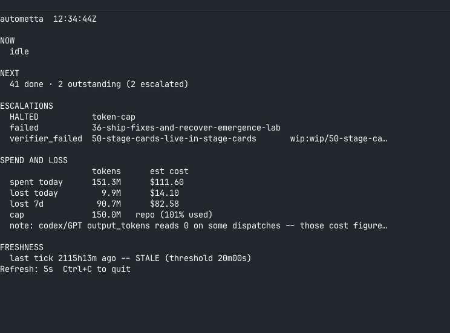
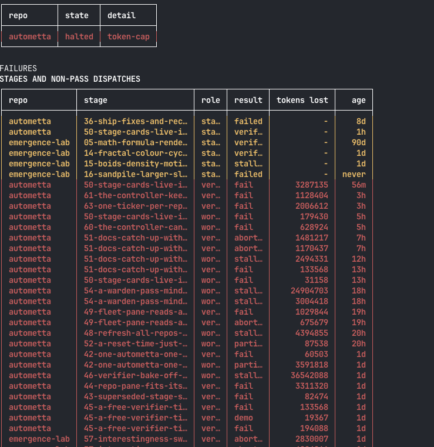
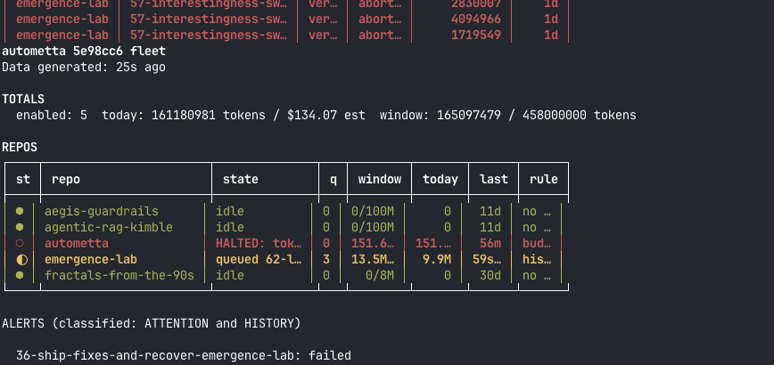

# Lessons log: the 2026-08-24 to 25 self-host run

**Repo:** `autometta` (self-host)
**Window:** 2026-08-24 evening to 2026-08-25 morning, still open
**Status:** running log, not a finished incident write-up. Kept while the run is
live so the review at the end has evidence rather than recollection.

This is deliberately one document for the whole run rather than one per
incident. Several of the failures below look unrelated and are not: three of
them are the same mistake about **where a path resolves**, and two more are the
same mistake about **what "idle" means**. That pattern is only visible with them
side by side, which is the reason for the format.

Each entry records what happened, what it cost, and where the fix lives. An
entry with no card is an open hole.

---

## Landed in this run

54 (a warden pass minds the queue), 56 (phat-controller is the minder, not the
loop), 57 (the dash shows its lights, its agents, and its spend), 51 (docs catch
up with the free verifier pattern), 59 (the budget meters both providers), 58
(the controller decides, the scripts are its verbs, PASS at 06:56 UTC, awaiting
integration).

Cards written and not yet queued: 61, 62, 63, 64.

---

## 1. Relative paths, absolute readers, and one symlink holding it together

**What happened.** Every path handed to an agent is relative:
`spawn-verifier.sh` builds `state/verifiers/<stage>.json`, the worker prompt
names `state/handoffs/<stage-id>.json`. The agent resolves those against its own
working directory, which is the run worktree. Every reader resolves them against
`repo_root`. The symlink `ensure_run_worktree` plants at `tick.sh:805` is the
only thing making writer and reader agree.

**What it cost.** Stage 51's verifier returned a genuine PASS on all six
criteria. The artefact landed in the run worktree, the tick looked in the main
repo, found nothing, scored the verifier `aborted` and re-dispatched. Two of
three attempts were burned on a verdict that already existed.

**The compounding error was mine.** Two workers, on cards 54 and 58, different
families and different tiers, both replaced the run worktree's `state/`
directory with a symlink. I read that as a worker defect twice, wrote it into
two re-briefs, and built a watcher that stripped the symlink automatically. That
watcher is what stranded stage 51's PASS. The workers were not blundering; they
were correctly diagnosing a broken path contract and repairing it.

**The general lesson, which is the most useful thing in this log:** when two
independent agents in two different families do the same odd thing, that is
evidence of a shared cause in the cards, the prompts or the mechanism. It is
almost never two coincidental mistakes. Treat the second occurrence as a signal
about the system, not about the agent.

**Fix:** card 62. Assert the symlink at both ends, or make the paths absolute,
but do not leave a relative path whose only guarantee is a symlink nothing
checks.

**Confirmed on teardown.** Stage 58 ran its entire life with the symlink
absent. `state/` in its run worktree was a real directory holding nothing but
`handoffs/`, verified by `test -L` before the worktree was removed. The
verifier recorded the absence in its own `additional_findings` and wrote to the
shared path anyway because it reasoned its way there; the worker's envelope
reached `state/handoffs/` in the main repo as well, byte-identical to the copy
left behind in the worktree.

So the stage passed on two agents' care rather than on the mechanism. That is
not a fix, it is a near miss with a good outcome, and it is the second run in a
row where the symlink's absence was survived rather than prevented. Card 62
stands, and this is the strongest evidence for it: the mechanism failed
silently and the run looked normal from the outside.

---

## 2. Declared gates that nothing enforces

**What happened.** Four cards carry a `Gate:` line. `add-stage.sh:62` extracts
three fields from a card and `Gate` is not among them, so the gate never reaches
`state.yaml`. `tick.sh:1916` then selects on `status == "pending"` and
`head -n1`. Position in the list is the only thing holding a gated stage back.

**What it cost.** Three dispatches, stage 50 twice and stage 60 once. Each one
cut a run worktree, created a run branch, spawned an agent and spent tokens to
learn a fact the tick could have read from a file for nothing. The worker read
`state.yaml`, found the prerequisite unmet, and refused. The agents did the
right thing expensively.

**The worse half is the record.** A worker that refuses exits without a passing
envelope, so the loop marks the stage `failed`. Stages 50 and 60 sat at `failed`
all morning and neither failed at anything. An operator cannot tell "attempted
and did not work" from "was never eligible to start", and those two facts call
for opposite next moves.

**The syntax is not uniform either**, which is part of why nothing parses it.
Card 51 spells it `- **Gate: card 46 completed first.**` with the condition
inside the bold span; cards 58, 60 and 61 spell it `- **Gate:** after 58.` with
the condition outside and the stage named by number rather than by id.

**Fix:** card 64.

---

## 3. A drain that spans the window boundary turns a daily reset into a 24-hour halt

**What happened.** The repo halted at 01:34 on `token-cap`, 205,702,516 tokens
against a resting cap of 150,000,000. It did not self-heal.
`budget_ensure_window` zeroes the counters only when the stored window is not
today **and** the budget is already halted or at cap. At the 01:00 UTC boundary
the drain was still in force, so the budget looked healthy, nothing was zeroed,
and `window_started_at` was stamped `2026-08-25`. The next automatic reset was
therefore 2026-08-26, not that morning.

**What it cost.** The run was dead from 01:34 until a human zeroed the counter
at 06:05.

**Fix:** none. **This is an open hole and it is card-shaped.** The trap is that
the healthy state at the boundary is exactly what suppresses the reset.

---

## 4. "No live agent" is not the same fact as "the tick is not mid-transaction"

**What happened.** My `queue-minder.sh` preserved stranded work when it saw no
live agent. The tick was mid-landing at that moment. Stage 51 fast-forwarded
onto dev carrying a `wip(...)` message with no author and no `Autometta-*`
trailers.

**What it cost.** The work was intact; the record was wrong. Dev was unpushed so
the commit was amended to `19289d9` with the correct author and trailers. Had it
been pushed it would have stood.

**The lesson.** `tick.sh` takes `state/.tick.lock`. Anything that writes to the
same state must take it too. An absence of agents says nothing about whether a
transaction is open.

**Fix:** card 61 carries the lock criterion. Preservation is disabled in the
re-armed minder, and the thing worth rebuilding is a tick-staleness kickstart,
never a preserver.

---

## 5. `current_stage` drives everything, and manual status edits orphan it

**What happened.** After a hand edit of stage 58's status, `.current_stage` was
left null. The tick looked for a pending stage, found none, and did nothing for
an hour while 58 sat `in_progress`.

**What it cost.** An hour of a run window, and a stretch of debugging aimed at
the agents rather than at the pointer.

**The lesson.** If the queue looks alive but nothing is happening, read
`.current_stage` first. It is one line and it is almost always the answer.

**Fix:** none yet. Related in shape to entry 2: the loop has several pieces of
state that must agree and nothing that checks they do.

---

## 6. Panel mode is unusable on this repo and fails closed loudly

**What happened.** Setting `Verifier panel: true` on card 58 halted the repo with
`dispatch-configuration-fault` before any agent started.
`spawn-verifier-panel.sh` requires `auth.claude.mode: api` and this repo runs
Claude on subscription.

**What it cost.** Nothing but time. It failed closed and burned no attempt,
which is the correct behaviour and worth recording as a thing that went right.

**Also stale:** the panel roster still names **Claude Opus 4.8** and **Claude
Sonnet 4.6**, both superseded identities since 2026-07-26.

**Fix:** none. Open hole, card-shaped. Panel stays `false` until then.

---

## 7. A stage that passes can still fail to land, and the merge is not mechanical

**What happened.** Stage 58 was dispatched from `19289d9`. While it ran, stage 59
landed and moved dev to `4320a6d`. 58 then passed at 06:56, committed as
`7bc8bf7` on its run branch, and the tick correctly declined to fast-forward:
`dev moved since dispatch; autometta/58-... left standing, pushed to origin for
manual integration`. The tick has logged `still awaiting integration` every five
minutes since.

**Why it is not mechanical.** 58 and 59 both touch `scripts/tick.sh`,
`scripts/phat-controller.sh` and `docs/cost-log.md`. A dry-run merge conflicts in
one place, `scripts/phat-controller.sh`, and the conflict is a false alignment
caused by 58's `warden_*` to `pc_*` rename sitting next to 59's edit of
`warden_record_triage_spend`.

**The hazard, which a careless resolution walks straight into.** 59's change adds
a `family` argument to `budget_account_tokens_from_dispatch` so a Codex
controller's tokens are parsed from a Codex transcript. 58's branch still has the
five-argument call at its line 1189. Resolving by "take 58's side" is the
obvious move and it **silently reverts 59**: `family` defaults to `claude` and a
Codex controller is mis-metered. The stage that fixed the meter would be undone
by the merge of the stage that renamed the file around it.

**The lesson.** The loop assumes one stage in flight at a time, and mostly that
holds. It does not guarantee that dev is unchanged across a long stage's
lifetime, and the ff-only landing is the only thing that notices. A run that
lands a short stage while a long one is out will keep producing these.

**How it was resolved**, 2026-08-25 08:12, by hand and with Tony's approval.
Cherry-picked `7bc8bf7` onto dev in a scratch worktree, resolved
`phat-controller.sh` by taking 58's structure and re-applying 59's `family`
argument to the renamed `pc_record_spend`, then confirmed 59's plumbing survived
in the auto-merged files too: `local family="${8:-claude}"`,
`budget_parse_dispatch_tokens_from_transcript` with its third argument, and the
`verifier_family_acct`, `worker_family_acct` and `stale_verifier_family_acct`
locals are all present in the merged `tick.sh`. All twenty offline smokes pass.
Dev is `0ae4a95` and pushed; the pre-rebase head is kept at
`refs/heads/backup/58-preintegration`.

**A second bug found during the resolution.** The integration record is derived
from **branch containment**: `reap-worktrees.sh:161` asks whether the run
branch's tip is an ancestor of the base branch. A rebase produces a new commit,
so the old tip is never an ancestor, and the reaper flips a hand-recorded
`merged` straight back to `awaiting`. It did exactly that on a dry run. The
worktree is then never torn down and the tick logs `still awaiting integration`
for ever, on a stage that has fully landed.

The workaround was to point the run branch at the rebased commit so containment
holds again. That works and it is not a fix: it means the only integration the
loop can recognise is a fast-forward, and a rebase, a squash or a
cherry-pick is invisible to it.

**Fix:** none. Open hole, and now two-part: the loop cannot land a stage whose
base has moved, and it cannot recognise any integration that is not a
fast-forward.

---

## 8. Smaller things, recorded so they are not re-learned

- **A manual `autometta tick` redirected to `/dev/null` writes nothing to
  `tick.err.log`.** Manual passes are invisible in the tick log. Capture them to
  a file or they did not happen as far as the record is concerned.
- **The TCC prompts seen overnight came from the headless `claude` CLI**
  (dialog reported 2.1.241 against a local 2.1.243) reaching iCloud Drive and
  network volumes. This is gotcha 11 territory and the best candidate for the
  22:36 tick freeze.
- **Reading a file out of a branch is unreliable here in two different ways,
  and both fail silently.** `git show <branch>:<path>` printed the commit and
  its whole diff rather than the blob, which briefly looked like a file full of
  diff markers and a corrupted commit. Later, `git rev-parse <branch>:<path>`
  returned the **commit** sha rather than the blob sha for a path that
  demonstrably exists, so a `cat-file` on it failed with `bad file`. Both
  happened on this repo, hours apart, and the second one bit after the first
  was already written down here. The reliable read is
  `git ls-tree <branch> <path>` to get the blob sha, then
  `git cat-file blob <sha>`. Anything that hands you a sha you did not verify
  is a sha you may be reading the wrong object from.
- **Stale vendor warnings repeat every tick** for `fractals-from-the-90s` and
  `emergence-lab`, both holding the contract from `9630ebb` against `4320a6d`.
  Harmless, and it is four lines of noise in every five-minute tick, which is
  most of what the tick log now contains.

---

## 9. Nothing prunes what a landed stage leaves behind

**What happened.** `reap-worktrees.sh` tears down a run *worktree* once its
branch is contained in the base. Nothing tears down the *branch*, and nothing
tears down the preserved-attempt branches at all. They accumulate silently for
as long as the repo runs.

**Measured on 2026-08-25, after 58 landed**, with the queue idle and every
stage below either completed or superseded:

- 6 remote run branches (`origin/autometta/40, 41, 43, 45, 46, 58`), every one
  of them either fully contained in dev or, in 58's case, an orphan left by the
  rebase. Pure duplicates of commits that had already landed.
- 11 local `wip/*` branches across 7 completed stages, 42 to 58. Unlike the run
  branches these hold **unique commits** that exist nowhere else: preserved
  work from attempts that failed before a later attempt succeeded.
- 17 local branches in total, of which 4 are load-bearing (`dev`, `publish`,
  `autometta/state`, `phat-controller/state`).

**Why it matters more than tidiness.** The two categories look identical in
`git branch` and are not remotely alike. Deleting a run branch whose stage has
landed loses nothing. Deleting a `wip/*` branch destroys the only copy of that
attempt's work. An operator clearing up on a Friday afternoon cannot tell them
apart by name, and the safe-looking bulk delete is the destructive one.

**How they accumulate faster than you would expect.** Entry 7 is the mechanism:
an integration the reaper cannot recognise leaves the worktree standing *and*
the branch behind, and the tick logs `still awaiting integration` for ever
while both sit there. Every rebase, squash or cherry-pick integration adds one
worktree and one branch that nothing will ever collect.

**The rule worth keeping.** A branch containing only commits reachable from the
base branch is disposable. A branch containing unique commits is evidence, and
it needs a decision rather than a sweep. Whatever eventually automates this must
sort on containment, not on name.

**Fix:** none. Open hole. Card-shaped, and it should be the same card as
entry 7, because the reason the litter is not collected is the reason the
integration is not recognised.

---

## 10. A rebuild costs twenty-five times a fix, and nothing warns you

**What happened.** Stage 63's attempt-1 worker spent **45,758,708 tokens**. A
normal worker on this repo spends between 1 and 2 million: stage 62's was
1,824,717 on the same day, against a card of comparable size. 63 was 25 times
that, and it took the day's total from 18.8M to 66.6M in a single stage.

**Where it went.** Not on thrashing. The work is sound and passed 9 of its 11
criteria: 1252 insertions across 9 files, a new renderer, a new smoke, a new
failures-history command. It went on building all of that from nothing.

**Why it matters.** The stage then failed verification on two criteria, and the
default move after a FAIL is to requeue. A requeue without a re-brief invites
attempt 2 to rebuild the same 1252 lines and spend the same 45M, because the
preserved branch is not part of the worker's prompt unless the card says so.
Two attempts like that is 90M against a 150M cap, on one card.

**Nothing in the loop notices.** The budget gate refuses a dispatch when the
cap is reached; there is no signal for "this dispatch cost twenty-five times
the median". The cost log has every figure needed to produce one:
`state/cost-log.jsonl` carries per-role totals, and the median over the last
ten dispatches is a one-line jq. The information exists and nothing reads it.

**Mitigation applied.** The attempt-2 re-brief on card 63 names the preserved
commit, states its size, and says the job is two focused fixes rather than a
rebuild. That is a per-card fix for a loop-shaped problem.

**Fix:** none in the mechanism. Open hole. An outlier warning is cheap and
would have flagged this while the worker was still running.

---

## 11. Cards ask for end-to-end evidence that an offline smoke cannot produce

**What happened.** Stages 63 and 61 failed verification back to back, on 2 of
11 and 4 of 8 criteria. Six failures across two cards, two families, two
workers, and five of the six are the same failure: **the smoke proves the
helpers compose, using fabricated artefacts, rather than exercising the real
path.**

61's four are almost comic in how consistent they are. The smoke hard-codes the
refusal text and calls `inbox-refuse` itself
(`scripts/phat-controller-smoke.sh:762-763`), calls `pc_inbox_scan` and
`pc_inbox_reply` directly without running a pass (`:733-752`), fabricates a
transcript and appends the index by hand (`:713-727`), and greps a planted file
rather than anything a pass produced (`:895-912`). In every case the verifier
found the **production ordering correct**. What was missing was evidence that
production runs.

63's version of it: the smoke captures a 160-column view and never asserts on
it (`scripts/repo-ticker-smoke.sh:147-148` against `:256-262`).

**Why it is not sloppiness.** An offline smoke cannot dispatch a live agent. The
cards ask for evidence from real passes: "a message left in the inbox is read at
the start of the next pass", "a forbidden request is refused and recorded". A
worker that must satisfy that offline has two options, fabricate the artefacts
or fake the dispatch, and fabricating is the shorter path. **The cards ask for
something the harness structurally cannot give, and the workers took the only
route left.** Same shape as entry 1: the mechanism invited the behaviour and
two independent agents took it.

**There is a way through and it is cheap.** Drive the real pass with a scripted
stand-in for the agent rather than calling the helpers directly. The production
path then genuinely executes, and the smoke asserts on what it produced. Both
re-briefs now say this.

**A harder blocker underneath 61.** The card asks for a transcript of what the
controller read, considered and rejected. On the default Claude route that
transcript cannot exist: the dispatch runs `claude --output-format json` piped
through `scripts/claude-token-log.sh`, which reduces the document to
`doc["result"]` and discards turn history
(`scripts/phat-controller.sh:1480-1482`, `scripts/claude-token-log.sh:22-37`).
Verified directly against the preserved branch rather than taken on the
verifier's word. No smoke work fixes that; the record has to be something the
controller writes, not something a log is mined for.

**The general lesson.** Before writing "prove X end to end" into a card, check
that the harness the worker will use can observe X. A criterion the harness
cannot satisfy is not a high standard, it is a trap, and it costs a full
dispatch to discover.

**Fix:** none. Open hole, and it is about how cards are written rather than
about the loop.

---

## 12. "Start from the preserved commit" puts a FAIL message in the trunk

**What happened.** Stage 63's attempt-2 re-brief told the worker to start from
the preserved commit `ece565c` rather than rebuild. It did exactly that: it
cherry-picked the preservation commit onto its run branch, made its two fixes
on top, and the stage landed. The fast-forward then carried **both** commits
onto dev.

So `a11d798` is now permanent history on the trunk, and its subject line reads:

```
wip(63-one-ticker-per-repo-that-fits-its-pane): attempt 1, verifier FAIL:
criterion 8 responsive columns and untruncated 119-column stage ids: The
119-column capture kept the long stage ids intact and the 80-column ...
```

A commit announcing a verifier FAIL, for work that passed, in a repo whose
convention is one atomic stage commit per stage with a written headline.

**What it is not.** Author and trailers are correct: `Claude Sonnet 5
<claude-sonnet-5@local>`, committer `anthonylwest`, vendor trailer present.
This is **not** the 2026-08-25 incident where a preserving watcher raced the
tick and put an unattributed `wip` commit on dev. The attribution is right;
the message and the granularity are wrong.

**Whose fault.** The re-brief's. "Start from the preserved commit" is an
instruction about provenance, and the worker read it as an instruction about
git mechanics, which is a fair reading. Nothing in the loop is broken.

**The wording that avoids it.** Ask for the preserved **tree**, not the
preserved commit: restore the files (`git checkout <sha> -- .`, or cherry-pick
with `--no-commit`) and let the stage produce **one** commit as every other
stage does. The provenance still belongs in the handoff envelope and the card,
where it is prose rather than history.

**Not fixed retroactively.** Squashing it would rewrite a dev that is already
pushed, and a non-fast-forward push is a human decision that a tidier log does
not justify. It stands.

**It did not recur.** Stage 61's re-brief carried the same "start from it"
phrasing and was already dispatched when this was noticed, so it was left
alone rather than amended mid-flight (gotcha 2, the card-sync race). Its
worker restored the preserved work **without** carrying the preservation
commit forward, and dev took one clean stage commit. So the phrasing is a
hazard rather than a guarantee: one worker read it as git mechanics, another
read it as provenance. That is exactly the kind of instruction worth making
unambiguous, because both readings are reasonable and only one of them is
visible afterwards.

**Fix:** none needed in code. A re-brief wording rule, and it belongs in
whatever template or skill governs re-briefs.

---

## 13. A re-brief only saves money when the work left is small

**What happened.** Two stages were re-briefed onto preserved work on the same
day, with the same instruction to start from what existed rather than rebuild.
The results went in opposite directions.

| Stage | Attempt 1 worker | Attempt 2 worker | Change |
|---|---|---|---|
| 63 | 45,758,708 | 6,596,878 | 7x cheaper |
| 61 | 16,244,090 | 30,705,010 | 1.9x dearer |

**Why the difference, and it is not worker quality.** 63's re-brief asked for
two narrow fixes on finished code: move three counts into the aggregator, and
uncap one column. Nearly all of attempt 1 was reusable, so nearly all of its
cost was saved.

61's re-brief asked for a structural change. The record had to become something
the controller writes rather than something a log is mined for, and the smoke
had to grow a scripted stand-in to drive a real pass. Most of attempt 1's smoke
was the thing being replaced, so there was little to reuse and the second
attempt did more work than the first.

**The lesson.** "Start from the preserved work" is an instruction about
provenance, not a cost control. When a re-brief changes the shape of the
solution rather than correcting details of it, expect attempt 2 to cost as much
as attempt 1 or more, and budget for it. A stage that has failed once is not
automatically cheaper the second time.

**Where it bit.** These two re-runs were 37.3M of the day's 145.5M. Combined
with 63's 45.7M first attempt, the three of them are more than half the daily
cap on one card's worth of delivered work.

**Fix:** none. A planning lesson rather than a defect. It pairs with entry 10:
the loop can neither warn about an outlier nor estimate what a re-brief will
cost.

---

## 14. The cap is a dispatch gate, so it is a soft ceiling

**What happened.** The run finished the day at **151,606,873 tokens against a
`token_cap_total` of 150,000,000**, and for several minutes after crossing it
`halted` still read `false`.

**That is not the cap failing.** `budget_gate_dispatch` runs *before* a
dispatch, never during one. A stage that is already running is not metered
against the cap until it finishes and the next dispatch is considered. So the
cap does not bound spend, it bounds *starting new work*, and the overshoot is
bounded by whatever the largest single dispatch happens to cost. On this repo
that could have been 45M, as stage 63's first attempt was.

The repo duly halted on `token-cap` at the following tick, once something next
tried to dispatch. Everything worked as written. The written behaviour is just
weaker than the name "cap" suggests.

**Related but different from the 2026-08-16 incident**
(`docs/incidents/2026-08-16-budget-cap-did-not-stop-dispatch.md`), where the
check was in the wrong place and produced a latch that several things could
unlatch. Here the check is in the right place and the latch holds. The gap is
that no check exists between dispatches.

**This halt will self-heal, unlike the previous night's.** `window_started_at`
is stamped `2026-08-25` and the repo is halted, so tomorrow's first tick
satisfies both of `budget_ensure_window`'s conditions (stored window is not
today, and the budget is halted) and zeroes the counters. The 24-hour trap in
entry 3 needed a drain spanning the boundary to suppress that, and no drain is
open. Lifetime spend now reads 382,554,291.

**Worth knowing when planning a window.** Budget for the cap **plus one large
dispatch**, not the cap. A resting cap of 150M with a 45M outlier in the queue
is really a 195M worst case.

**Fix:** none. Arguably correct as designed, and the honest fix is
documentation rather than code: say "no new work starts past this line" rather
than "cap".

---

## 15. The alarm has been stuck on since May

**What happened.** An hour after stage 63 landed a new repo ticker, its
FRESHNESS panel read `last tick 2115h13m ago -- STALE (threshold 20m00s)`. The
tick had run four minutes earlier.



`state/state.yaml` carries `last_tick_at: "2026-05-29T09:21:18Z"` and
`tick_count: 0`. **Nothing writes either field.** Every reference in the tree
is a test fixture setting the value by hand, except one comment at
`scripts/tick.sh:1495` which asserts that `tick_count/last_tick_at update every
tick regardless of whether a stage is running`. That comment has been wrong
since May and reads authoritatively enough to stop anyone checking.

**The renderer is innocent.** `repo-ticker-render.py:368` reads the field,
`aggregate-dashboard.sh:188` copies it from state, and both do the right thing
with the value they are given.

**Why it is worse than a wrong number.** FRESHNESS exists to say the loop has
stopped. It is stuck in the "stopped" position, so it cried STALE all day while
the loop ran perfectly, and it will cry STALE in exactly the same words on the
day the loop genuinely dies. An alarm that is always on is not an alarm.

**How it passed a verifier yesterday.** Card 63's criterion 7 asked for
freshness in both states and got them, because the smoke sets `last_tick_at` in
four of its own fixtures. The renderer was proved against fixture input and the
input itself was never checked. This is entry 11 again, found the day after
entry 11 was written, in the work that was landing while it was written.

**The general lesson, sharper than entry 11's.** A test that supplies the value
it is testing proves the consumer and says nothing about the producer. When the
field crosses a process boundary, at least one assertion has to start from the
real producer. Card 65's smoke drives a real tick for exactly this reason.

**Fix:** card 65.

---

## Open holes, collected

Entries above with no card, in the order I would write them:

1. The drain that spans the window boundary (entry 3). It kills a whole run
   window and it is invisible until someone reads `budget.json`.
2. Landing a stage when the base has moved, and recognising an integration
   that is not a fast-forward (entry 7). Resolved by hand for stage 58; the
   mechanism is unchanged and will do it again.
3. Panel mode: the api-mode requirement and the superseded roster (entry 6).
4. State that must agree and nothing checking it, `current_stage` first
   (entry 5).
5. Nothing prunes a landed stage's branches or an unrecognised integration's
   worktree (entry 9). Same card as 2, most likely.
6. No outlier warning on dispatch cost (entry 10). One stage spent a third of
   the daily cap and nothing said so until it was over.
7. Cards asking for evidence the offline harness cannot produce (entry 11).
   Six criteria across two stages, one cause.
8. Re-brief wording that puts preservation commits in the trunk (entry 12).
   A documentation fix, not a code one.

Cards now cover three of these: 65 (entry 15, the stuck heartbeat), 66 (the
fleet view's unbounded failures table, seen below), and 67 (entry 10, no
outlier warning).



The fleet view still renders every non-pass dispatch across every subscriber
back to 90 days, which is what card 63's criterion 10 removed from the repo
view. Its top half is worth keeping:



## What went right, recorded on purpose

- Panel mode failed closed before spending anything (entry 6).
- The ff-only landing refused to merge a stage whose base had moved rather than
  guessing (entry 7).
- Workers refused ungated stages instead of proceeding, three times (entry 2).
- Two workers independently diagnosed a genuine path bug (entry 1).

Four of this run's most expensive incidents were the system or the agents doing
the right thing, and being misread by me.
